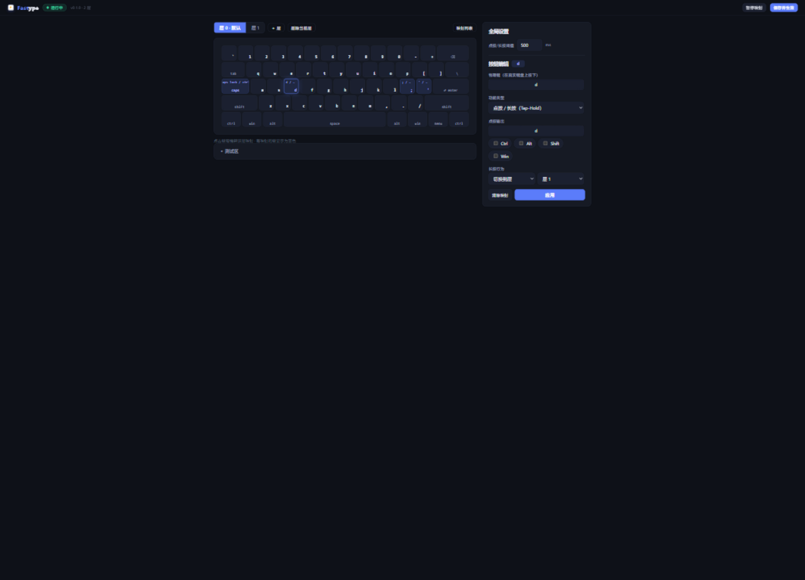

# fastype

[](https://github.com/xiongyihui/fastype/actions/workflows/build.yml)

**fastype** 是一个 Windows 键盘增强工具：让普通键盘学会「长按」与「分层」。
不用换键盘、不用刷固件、不用改打字习惯，把方向键、快捷键这些最常用的功能搬到手边，让写代码更快、更省力。

## 设计理念

数一数你写代码时右手离开主键区的次数：够方向键、够 Home/End、够翻页键，小拇指一次次压向角落里的 Ctrl……

fastype 的设计，源自研究 60% 键盘按键方案时的发现：普通键盘只需要 **长按**、**组合键**、**层** 三种机制，就能覆盖绝大多数效率需求——
让手始终停留在 ASDF / HJKL 附近，类似VIM。

- **长按（Tap-Hold）**：一个键，点按是它自己，长按变成别的功能（切层或按住修饰键）
- **组合键**：把任意物理键映射成另一个键或组合键，如 `p` → `Shift+Insert`（粘贴）
- **层（Layer）**：按住某个键期间，整块键盘临时切换到另一套映射，松开即回

## 开箱即用

第一次运行自动生成一套与上述理念一致的默认配置，立即生效：

| 你按下的键 | 输出 |
|---|---|
| 快速点按 <kbd>d</kbd> / <kbd>;</kbd> / <kbd>'</kbd> / <kbd>CapsLock</kbd> | 一切照旧，输出原键 |
| **按住 <kbd>d</kbd>** 再按 <kbd>H</kbd> <kbd>J</kbd> <kbd>K</kbd> <kbd>L</kbd> | 方向键 ← ↓ ↑ → |
| 按住 <kbd>d</kbd> 再按 <kbd>U</kbd> / <kbd>N</kbd> | 上一页 / 下一页 |
| 按住 <kbd>d</kbd> 再按 <kbd>Y</kbd> / <kbd>M</kbd> | 行首 / 行尾 |
| 按住 <kbd>d</kbd> 再按 <kbd>P</kbd> | 粘贴（Shift+Insert） |
| 按住 <kbd>d</kbd> 再按 <kbd>;</kbd> / <kbd>'</kbd> | 退格 / Esc |
| **长按 <kbd>;</kbd>** 再按 <kbd>C</kbd> / <kbd>V</kbd> / <kbd>X</kbd> / <kbd>A</kbd> | 复制 / 粘贴 / 剪切 / 全选（等价 Ctrl 组合键） |
| 长按 <kbd>'</kbd> | 按住 Alt |
| 长按 <kbd>CapsLock</kbd> | 按住 Ctrl（点按仍是原 CapsLock） |

+ **按住 d 就进入一层临时导航层**，编辑代码时手不离主键区就能移动光标、翻页、跳行首行尾；
+ **长按分号就是 Ctrl**，复制粘贴不再需要小拇指下探。

而快速点按时所有键保持原功能——你原有的打字习惯完全不受影响。

点按与长按的判定阈值默认 500ms，可在配置界面调整。

## 上手三步

正式版到 [Releases](https://github.com/xiongyihui/fastype/releases) 下载；或打开
[Actions 构建页](https://github.com/xiongyihui/fastype/actions/workflows/build.yml)）下载最新一次成功构建 `fastype-windows-amd64` 产物。

1. **运行** `fastype.exe`（首次运行自动生成 `config.json`）
2. 屏幕右下角出现**托盘图标**：双击打开配置页面，右键可 打开配置 / 暂停映射 / 开机自启 / 退出
3. 浏览器访问 `http://127.0.0.1:8765/` ，可视化编辑你的键盘

开机自启：托盘右键菜单点「**开机自启**」即可一键开启/关闭；也可以手动把 `fastype.exe` 的快捷方式放进 `shell:startup` 文件夹
（Win+R 输入 `shell:startup` 回车即达）。

## 可视化配置界面



配置页面采用Web UI可视化键盘：

- 点击任意**键帽**，在侧边面板编辑它在当前层的映射
- 绑定按键不用打名字——点击输入框后**直接按键盘**捕获，修饰键（Ctrl/Alt/Shift/Win）
  用复选框勾选
- 顶部切换**层**，可增删层（最多 8 层）
- **保存并生效**：保存即热更新，无需重启程序
- 配置期间如果映射干扰输入，点右上角**暂停映射**，改完再恢复
- 页面内置**测试区**，改完立即试打感受效果

## 三种映射能力

配置界面里每个键可以绑定三种功能之一：

1. **映射为按键 / 组合键**：按下即输出指定键或组合键（如 `caps lock` → `esc`）
2. **点按 / 长按（Tap-Hold）**：点按输出原键或任意键；长按切换到某一层，或按住
   修饰键（于是这个键变成了你的 Ctrl/Alt/Shift/Win）
3. **切层**：按下立即切换到某一层，可附带修饰键（相当于 QMK 的 MO/LT 语义）

层内没有映射的键直接透传原始按键，所以每一层只需要配置「改动的键」。

## 命令行与环境变量

```
fastype.exe            # 正常启动
fastype.exe --dry-run  # 演练模式：只打印判定结果，不拦截任何按键（试用无风险）
fastype.exe --config D:\my.json
fastype.exe --version / --help
```

| 环境变量 | 作用 |
|---|---|
| `FASTYPE_DEBUG=1` | 打印每次按键的判定过程（调试点按/长按行为） |
| `FASTYPE_DRY_RUN=1` | 等同 `--dry-run` |
| `FASTYPE_CONFIG` | 指定配置文件路径 |

配置文件查找顺序：`--config` 参数 > `FASTYPE_CONFIG` > 当前目录 `config.json` >
exe 同目录 > `%APPDATA%\fastype\config.json`。日常用配置界面编辑即可，一般不需要手改。

## 常见问题

**为什么在管理员窗口（任务管理器等）里不生效？**
普通权限的低级键盘钩子收不到发往管理员程序的事件。需要时右键「以管理员身份运行」
fastype（自启快捷方式同理，在任务计划程序里以最高权限创建更省心）。

**游戏里会生效吗？**
部分游戏及其反作弊会无视程序合成的按键，请不要在游戏中依赖 fastype，也请遵守游戏规则。

**退出后按键会卡住吗？**
不会。托盘退出或 Ctrl+C 时会自动释放所有按住的合成键。

**能双开吗？**
不能。启动时若检测到已有实例会直接提示退出，避免两个钩子互相干扰。

**临时不想用怎么办？**
托盘右键「暂停按键映射」，或配置页面右上角暂停按钮；彻底不用就从托盘退出。

**支持哪些系统？**
仅 Windows x64。

## 从源码构建

需要 Go ≥ 1.22，零第三方依赖：

```
go test ./...
go build -ldflags "-s -w -H windowsgui" -o dist\fastype.exe .\cmd\fastype
go build -ldflags "-X main.debugDefault=1" -o dist\fastype-debug.exe .\cmd\fastype
```

`fastype.exe` 日常使用（无窗口后台运行）；`fastype-debug.exe` 带控制台，
启动即输出按键判定日志，排查点按/长按行为用。

## 来源与致谢

- 设计理念源自 [keyboard](https://github.com/xiongyihui/keyboard)
- [TMK](https://github.com/tmk/tmk_keyboard) 的 Layers 设计
- Jason Rudolph 的 [Toward a more useful keyboard](https://github.com/jasonrudolph/keyboard)
- [QMK](https://qmk.fm) / [VIA](https://www.caniusevia.com) 社区——层语义与配置界面的灵感来源
